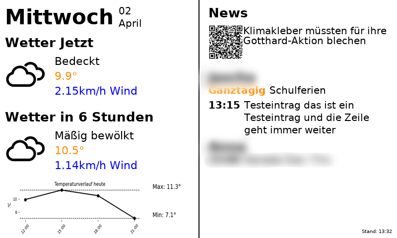

# 🖥️ Inky Infodashboard

Ein Infodisplay für das Inky Impression 7.3" Display auf dem Raspberry Pi.  
Zeigt Wetter, News, Kalendertermine (auch ganztägige), QR-Codes, sowie ein Temperaturdiagramm an – optimiert für E-Ink.

---

## ⚙️ Features

- Lokale Wetterdaten von OpenWeatherMap
- Automatische Vorschau der nächsten 6 Stunden
- RSS-News (z. B. 20min.ch) mit QR-Code
- Google-Kalender-Integration für mehrere Konten
- Temperaturverlauf des Tages mit Min-/Max-Markierung (Matplotlib)
- Viertelstündliches Update via Cronjob

---

## 📦 Projektstruktur

```text
Inky_Infodashboard/
├── app.py                  # Hauptprogramm (zeichnet das Dashboard)
├── weather.py              # Wetterdaten (OpenWeatherMap)
├── calendar_helper.py      # Google-Kalender-Integration
├── icon_helper.py          # Pfade für Wetter-Icons
├── config.py               # API-Einstellungen aus .env
├── requirements.txt        # Python-Abhängigkeiten
├── static/                 # Fonts
├── icons/                  # Lokale SVG-Wettersymbole
├── .env                    # API Key für OpenWeatherMap (nicht in Git!)
├── credentials.json        # Google OAuth
├── token.json              # Zwischengespeicherte Tokens
├── dashboard_simulation.png# Optional: Vorschau vom generierten Bild
├── setup.sh                # Einmaliges Setup-Skript
└── README.md               # Diese Datei
```

---

## 🚀 Installation

```bash
git clone https://github.com/dein-benutzer/Inky_Infodashboard.git
cd Inky_Infodashboard
chmod +x setup.sh
./setup.sh
```

---

## 🔁 Automatische Anzeige

Das Skript `setup.sh` richtet einen **Cronjob** ein, der `app.py` automatisch alle 15 Minuten aufruft und das E-Ink Display aktualisiert.

---

## 🌐 APIs & Zugang

- `.env` muss folgendes enthalten:

```env
API_KEY=dein_openweathermap_api_key
```

- Für Google Kalender muss `credentials.json` vorhanden sein.  
  Beim ersten Start wird automatisch `token.json` erstellt.

---

## 🖼️ Beispielanzeige



*Lege dein Bild z. B. in einen `assets/`-Ordner und referenziere es so.*

---

## 🧪 Manuelles Testen

```bash
python3 app.py
```

---

## 📅 Cronjob prüfen

```bash
crontab -l
```

---
